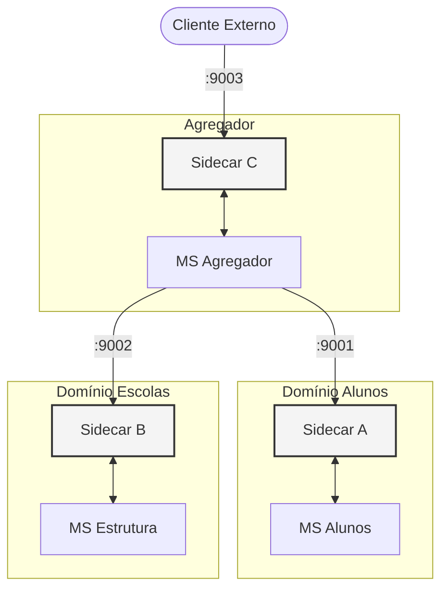

# Documentação Técnica da POC: Padrão Sidecar em Python

Este documento consolida a especificação técnica e funcional da Prova de Conceito (POC) do Padrão Sidecar, apresentando os padrões de resiliência, observabilidade e arquitetura implementados para orquestração de microsserviços.

---

## Proposta e Objetivo

O objetivo desta POC é validar a implementação de uma malha de serviços leves utilizando o padrão Sidecar em Python. A arquitetura visa desacoplar responsabilidades de infraestrutura (como retentativas, circuit breakers e telemetria) da lógica de negócio das aplicações, garantindo um sistema resiliente e observável por padrão.

---

## Visão Geral da Arquitetura

A malha é composta por três microsserviços principais, cada um acompanhado por um Proxy dedicado (Sidecar) que gerencia a comunicação de rede de saída e entrada.



---

## Matriz de Componentes e Responsabilidades

| Componente | Papel Arquitetural | Porta App | Porta Sidecar | Responsabilidade Principal |
| :--- | :--- | :--- | :--- | :--- |
| **MSA** | Fornecedor de Dados | 8001 | 9001 | Gestão de registros de alunos (CRUD) |
| **MSB** | Fornecedor de Dados | 8002 | 9002 | Gestão da hierarquia escolar e turmas |
| **MSC** | Orquestrador | 8003 | 9003 | Agregação e normalização de dados |

---

## Padrões de Resiliência (Sidecar Engine)

Os Sidecars atuam como proxies reversos inteligentes, implementando os seguintes padrões de rede:

### 1. Circuit Breaker
Utilizado para evitar falhas em cascata. O estado do circuito é monitorado continuamente:
- **Detecção de Falha**: Configurado para 5 erros consecutivos no serviço backend.
- **Fail-Fast**: Interrompe o tráfego para serviços instáveis, retornando instantaneamente HTTP 503.
- **Recuperação**: Transição automática para o estado de avaliação após período de cooldown.

### 2. Retentativas (Retry Logic)
Gerencia falhas temporárias de rede de forma invisível para a aplicação:
- **Exponential Backoff**: Espaçamento crescente entre tentativas para evitar saturação.
- **Normalização de Erros**: Converte exceções de rede (timeouts, conexão recusada) em respostas HTTP 502/503.

### 3. Timeout Control
Garante que requisições lentas não bloqueiem recursos do sistema, mantendo a performance da malha.

---

## Observabilidade e Telemetria

A infraestrutura utiliza o framework OpenTelemetry para garantir rastreabilidade completa.

### Tracing Distribuído
- **Propagação de Contexto**: Utilização de cabeçalhos padrão para manter o vínculo entre todas as requisições da cadeia.
- **Instrumentação Granular**: Captura de spans para medir latência local vs. latência de rede em cada salto.
- **Logs Estruturados**: Logs em formato JSON para fácil correlação com os traces.

---

## Padrões de Desenvolvimento (SOLID)

Os microsserviços foram construídos seguindo princípios modernos de design:
- **Service Layer**: Lógica de negócio isolada das views e do acesso a dados.
- **Injeção de Dependências**: Facilitação de testes unitários através de mocks.
- **Isolamento de Testes**: Suítes de testes localizadas na raiz de cada projeto em pastas segregadas do código produtivo.

---

## Estrutura do Projeto

```text
POC-SIDECAR/
├── msa/                # Projeto Microsocerviço Alunos
├── msb/                # Projeto Microserviço Escolas
├── msc/                # Projeto Microserviço Agregador
├── sidecar_a/          # Proxy p/ MSA
├── sidecar_b/          # Proxy p/ MSB
├── sidecar_c/          # Proxy p/ MSC
├── logs/               # Logs consolidados
└── run_all.py          # Script de inicialização da malha
```

---

## Guia de Execução e Validação

### Pré-requisitos
- Python 3.10+
- Framework Django 6.0 e bibliotecas: httpx, pybreaker, tenacity, opentelemetry.

### Inicialização
Para carregar todos os serviços e proxies simultaneamente:
```bash
python run_all.py
```

### Validação de Testes
Para executar a suíte de testes de resiliência e lógica (exemplo):
```bash
cd sidecar_a
python manage.py test tests
```

---

## Manual de Simulação e Apresentação (v2.0)

Para facilitar a validação dos padrões com stakeholders, foi criado um dashboard interativo (Sidecar Mesh Manager) que permite simular falhas, observar retentativas e analisar traces em tempo real.

### Execução do Dashboard
1. Inicie o orquestrador:
```bash
python dashboard_server.py
```
2. Acesse no navegador: **[http://localhost:9999](http://localhost:9999)**

### Cenários de Demonstração e Comportamento Esperado

#### 1. Fluxo de Sucesso e Telemetria
- **Ação**: Clique em "EXECUTAR CHAMADA AGREGADA" com todos os serviços em verde (ON).
- **Comportamento Esperado**: Retorno imediato (HTTP 200). 
- **Observabilidade**: No painel de Telemetria, selecione o "Sidecar C". Você verá o objeto JSON do Trace gerado, contendo o `trace_id` e os spans da requisição.

#### 2. Resiliência de Rede (Microserviço Offline)
- **Ação**: Clique diretamente no card de status do **MSA** ou **MSB** (eles ficarão vermelhos/OFF) e execute a chamada.
- **Comportamento Esperado**: A malha aplicará retentativas. O tempo de resposta aumentará (~3s).
- **Graceful Degradation**: O Agregador retornará o JSON parcial. Se o MSA estiver OFF, você verá a estrutura escolar, mas com as listas de alunos vazias (`"alunos": []`), provando que a falha de um domínio não derruba o sistema todo.

#### 3. Circuit Breaker e Fail-Fast
- **Ação**: Com um serviço offline, faça várias chamadas rápidas.
- **Comportamento Esperado**: O status badge mudará para **503** de forma instantânea. O Sidecar bloqueia o tráfego antes mesmo de tentar a rede, protegendo o Agregador.

#### 4. Auto-Recuperação e Propagação de Contexto
- **Ação**: Clique em "SUBIR MSA/MSB" e execute o teste.
- **Comportamento Esperado**: O sistema volta a responder 200 com os dados completos após o período de cooldown do Circuit Breaker.
- **Validação**: Verifique nos logs do Dashboard que o `X-Request-ID` (ex: `UI-1234567`) foi propagado para todos os sidecars envolvidos.

---

## Benefícios e Conclusão

1. **Padronização de Infraestrutura**: Capabilidades de rede idênticas para todos os serviços, independente da linguagem futura.
2. **Observabilidade Nativa**: Redução do tempo de diagnóstico através de traces completos.
3. **Desacoplamento Técnico**: A lógica de infraestrutura evolui sem necessidade de alteração nos microsserviços.
4. **Segurança de Futuro**: Arquitetura pronta para adoção de Service Mesh (Envoy/Istio) de forma transparente.
